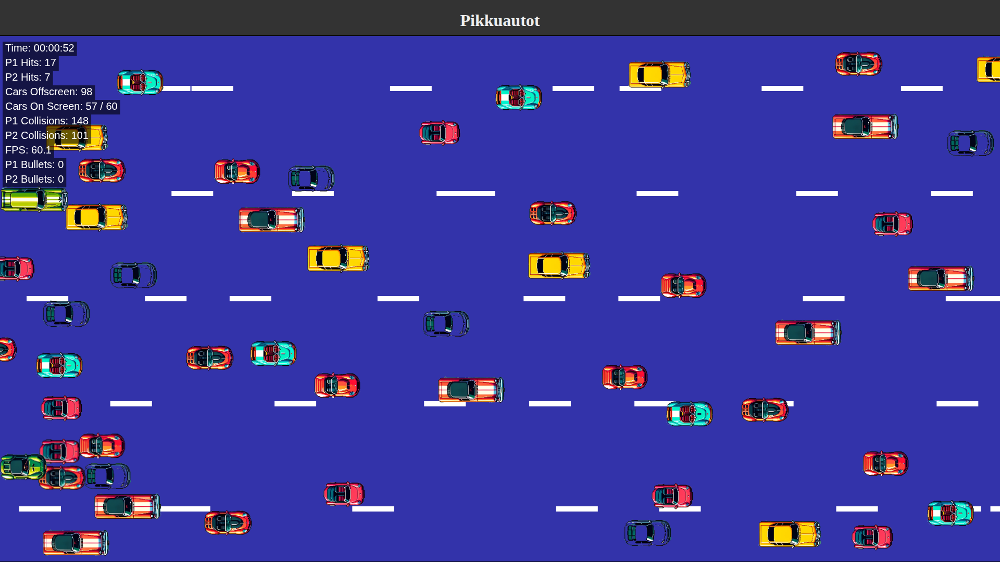

# js_pikkuautot
---

# 🚗 Car Dodging Game (2-Player) – JavaScript + HTML5

A chaotic two-player top-down driving game built using **JavaScript** and **HTML5 Canvas**. Players control their cars, avoid oncoming traffic, shoot bullets, and compete by dodging or destroying enemy cars. The game features dynamic spawning, smooth animations, collision detection, and live stat tracking — all running directly in the browser.

---
### Play it now: https://pemmyz.github.io/js_pikkuautot/

## 📸 Screenshots

### Game
  

---

## 🎮 Features

- Two-player local multiplayer using keyboard
- Bullets with separate counters and hit detection
- Randomly spawning enemy cars with sprite rotation
- Collision handling with car un-stuck logic
- Scrolling road markings for visual speed feedback
- Real-time stats: time played, FPS, kills, dodges, and more
- Optimized HTML5 Canvas rendering loop
- Auto-loads car sprites from the `auto/` folder

---

## 🕹 Controls

### Player 1
- `Arrow Keys`: Move  
- `Space`: Shoot  
- `R`: Reset position

### Player 2
- `W`, `A`, `S`, `D`: Move  
- `F`: Shoot

### Common
- `Esc`: Quit or pause game

---

## 🎮 Gameplay

- Two players each control a car on a multi-lane highway.
- Enemy cars appear and race toward the bottom of the screen.
- Dodge incoming traffic or shoot your way through — ammo is limited!
- Tracks key stats:
  - Cars dodged
  - Enemies destroyed by each player
  - Crashes and collisions
  - Real-time FPS and game duration

As the game progresses, the challenge increases. More enemies, more bullets, and more chaos. Can you outlast your opponent?

---

🔥 _A fast, chaotic, and competitive driving game crafted for the browser with JavaScript and HTML5._
